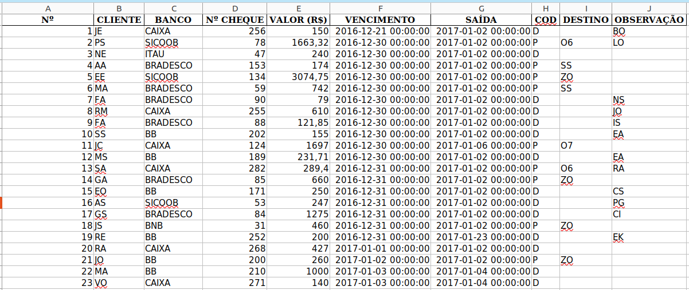
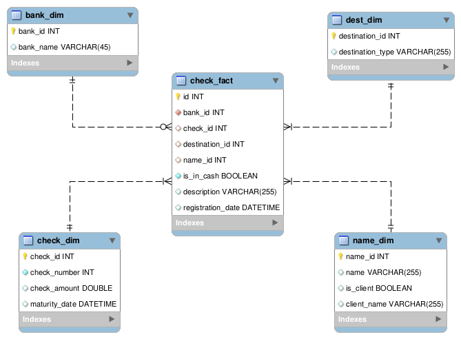

# Boas vindas ao **dim_model!**

Para executar o projeto, observe as orientações descritas a seguir, e se tiver qualquer dúvida, sugestão, contribuição, considere abrir uma issue ou entrar em contato. 🚀

Aqui você vai encontrar os detalhes de como está estruturado e foi desenvolvido o projeto.

# <a id='topicos'>Tópicos</a>
- [Desenvolvimento](#desenvolvimento)
  - [Objetivo](#objetivo)
  - [Estrutura do projeto](#estrutura)
  - [Tecnologias utilizadas](#tecnologias)
- [Orientações](#orientacoes)
  - [Executando o projeto](#execucao)
    - [1. Sem o docker](#sem-docker)
    - [2. Com o docker](#com-docker)
  - [Linter](#linter)
  - [Testes](#testes)
  - [Diagrama ER e Modelagem dos dados](#der)
- [Implementações](#implementacoes)
  - [Contextualizando](#contextualizando)
  - [Consumindo as tabelas](#consumindo)
- [Próximos passos](#next)

# <a id='desenvolvimento'>[Desenvolvimento](#topicos)</a>

<strong><a id='objetivo'>[Objetivo](#topicos)</a></strong>

  O **objetivo** é fazer a modelagem dimensional de um controle de cheques, atualmente em [**planilhas excel**](dim_model/sheets).
  
  Para isso, foi feita a [**Extração, Transformação e Carga (ETL)**](#tecnologias) e [**modelagem dos dados**](#der) tornando a disponibilidade e consumo dos dados escalável e com maior segurança.

  ---

<strong><a id='estrutura'>[Estrutura do projeto](#topicos)</a></strong>

* **Na pasta [dim_model](dim_model) estão os diretórios:**
  * **[configs](dim_model/configs)** com os arquivos de configuração da execução do código-fonte. Possui **_as regras de negócio_** da aplicação;
  * **[sheets](dim_model/sheets)** com os arquivos de origem dos dados mascarados do controle de cheques atual.
* **E os arquivos:**
  * **[read.py](dim_model/read.py)** com a classe **Read**, que lê os dados das planilhas retornando um dataframe pandas para tratamento dos dados;
  * **[transform.py](dim_model/transform.py)** com a classe **Transform**, executora do tratamento dos dados brutos à partir das regras de negócio definidas;
  * **[model.py](dim_model/model.py)** com a classe **Model** que contém a modelagem nos dados tratados para criação das tabelas fato e dimensões;
  * **[write.py](dim_model/write.py)** com a classe **Write** que abstrai a escrita dos dados modelados para suas respectivas tabelas;
  * **[orchestrator.py](dim_model/orchestrator.py)** com a classe **Orchestrator** que orquestra a execução dos objetos das classes anteriores, simulando uma **pipeline de dados**.
  * **[main.py](dim_model/main.py)** com a classe **Main**, executora do código-fonte da classe Orchestrator.
  * **[transform_data.ipynb](dim_model/transform_data.ipynb)** notebook jupyter com o código-fonte original (não utilizado no projeto atual).
* **Na pasta [images](images) estão os arquivos:**
  * **[EER.png](images/EER.png)** imagem com o schema **[da modelagem dos dados](#der)** final das tabelas criadas;
  * **[sheet_structure.png](images/sheet_structure.png)** imagem com sample das planilhas fonte de dados;
* **Na pasta [tests](tests) estão os arquivos com os testes dos respectivos arquivos do código-fonte.**
* **E os arquivos:**
  * **[#.env](#.env)** com as variáveis de ambiente utilizadas na aplicação para comunicação com o banco `mysql`. 
    >IMPORTANTE:<br/>Tire a hashtag do nome do arquivo para execução do projeto.
  * **[docker-compose.yml](docker-compose.yml)** arquivo que possibilita a execução da aplicação, orquestrando as imagens docker do `mysql` e `python`;
  * **[Dockerfile.MySQL](Dockerfile.MySQL)** container docker do `mysql` para criação do servidor deste banco de dados, com as especificações necessárias para a aplicação;
  * **[Dockerfile.Python](Dockerfile.Python)** container docker do `python` com as especificações necessárias para a aplicação;
  * **[mysql_local.sh](mysql_local.sh)** código shell criado como opção **[para execução do código sem um servidor `mysql` local](#execucao)**
  * **[requirements.txt](requirements.txt)** arquivo com as dependências necessárias e utilizadas para execução do projeto;
  * **[tox.ini](tox.ini)** arquivo com a configuração de uso da [análise estática do código](#linter).

<strong><a id='tecnologias'>[Tecnologias utilizadas](#topicos)</a></strong>

  O projeto foi desenvolvido em Python para construção do script de ETL e modelagem de dados.

  Para o processamento dos dados, essas foram as bibliotecas utilizadas:

* **[Pandas](https://pandas.pydata.org/):**
  * Ferramenta open source focada na facilidade para manipulação e análise de dados, totalmente integrada com a linguagem python;
* **[SQLAlchemy](https://www.sqlalchemy.org/):**
  * ORM python, utilizada para relacionar um código python com os dados que ele se relaciona principalmente de um banco de dados relacional (SQL).
* **[SQLAlchemy-utils](https://sqlalchemy-utils.readthedocs.io/en/latest/):**
  * Built-in do `SQLAlchemy` que abstrai funções do seu mapeamento da fonte de dados utilizadas.

>No arquivo de dependências, **[requirements.txt](requirements.txt)**, é listada outras dependências acessórias à essas bibliotecas e também utilizadas para **[análise do código](#linter)** e **[testes da aplicação](#testes)**.
    
# <a id='orientacoes'>[Orientações](#topicos)</a>

<strong><a id='execucao'>[Executando o projeto](#topicos)</a></strong>

A aplicação foi pensada para ser testada com o `Docker`, visando torná-la o mais agnóstica possível.

É possível sua execução sem a ferramenta, com sugestões para os dois cenários abaixo:

>**IMPORTANTE**<br/>Independente da escolha, após clonar o projeto, entre com seu terminal na pasta criada:<br/>`cd dim_model`<br/>**Todas orientações abaixo, tem essa pasta como referência.**


<!-- <h3><strong><a id='sem-docker'>1. Execução sem o docker:</a></strong></h3> -->

### <strong><a id='sem-docker'>[1. Execução sem o docker:](#topicos)</a></strong>

Nesse cenário, é necessário que sua máquina possua instalado: i. um servidor `mysql`; ii. e o `python`. Sobre essas ferramentas:

#### **i. MySQL:**

  >Atualize o arquivo [.env](.env) com as configurações do seu servidor local.

  ```docker
  DB_USER=root
  DB_NAME=Checks
  DB_PASSWORD=123456
  DB_HOST=mysql_db
  ```

#### **ii. Python:** 
  
  O projeto foi construído com o python na versão 3.8, porém **não se espera indisponibilidades com sua execução à partir da versão 3.4.** 

  **Qualquer incompatibilidade com a versão da sua máquina por favor informe.**

  Ainda, é recomendada a instalação prévia do gerenciador de pacotes `pip` para os passos a seguir:

  >**(Recomendado)** **Utilizar um ambiente virtual** com os seguintes comandos (nome `model_venv` já considerado na ferramenta de [lint](#lint)):
  ```shell
  # cria o ambiente com o nome model_venv:
  python3 -m venv model_venv 
  # ativa o ambiente em terminais Linux e Mac:
  source model_venv/bin/activate
  # ativa o ambiente em terminal Windows (cmd):
  model_venv\bin\activate
  ```
  >1.**Instalar dependências do projeto:**
  ```ps1
  pip install -r requirements.txt
  ```
  >2.**Setar PYTHONPATH:**
  ```shell
  export PYTHONPATH=./
  ```
  >3.**Executar projeto (na pasta criada com o clone):**
  ```bash
  python3  dim_model/main.py
  ```
  >4.**Executar projeto instanciando a classe Main (na pasta criada com o clone):**
  ```python
  from dim_model.main import Main

  Main().run_pipeline()
  ```
  >5.**Executando testes (na pasta criada com o clone):**
  ```ps1
  pytest -v
  pytest --cov=tests/
  ```

### <strong><a id='com-docker'>[2. Execução com o docker:](#topicos)</a></strong>

>**IMPORTANTE**<br/>Nesse cenário recomenda-se utilizar as versões a seguir das ferramentas docker:<br/>`docker:25.0.3`  `docker-compose:1.29.2` <br/>**Verifique suas versões com os comandos:** <br/>`docker version` e `docker-compose -v`

### 2.1. Usando imagem docker do MySQL (para Linux ou Mac):
Caso não possua ou opte por não usar um servidor mysql, execute o seguinte comando:
```bash
# na raiz do projeto, dê permissão para execução do script mysql_local.sh:
chmod 777 ./mysql_local.sh
# execute o arquivo:
./mysql_local.sh
```
>**IMPORTANTE**<br/>Esse script modifica o valor do host no arquivo .env. Caso use as outras formas de execução do projeto depois, restaure o valor original do arquivo.

Caso tenha problema na execução do script, veja a situação do container que ele cria:
```bash
# verifique se o container está em execução:
docker ps -la
# caso não esteja em execução, veja logs do container
docker logs mysql_db
# para parar o container caso necessário:
docker stop mysql_db
# após pará-lo apague-o:
docker rm mysql_db
```

Com o container local em execução, siga á partir do passo 3 da execução do código com `python` [dessa seção](#topicos)

### 2.2. Usando docker-compose para orquestrar imagens:
Com o docker-compose não é necessário ter o python nem o mysql instalados localmente. Nessa opção, a execução do código será feita automaticamente também.

Passos para sua inicialização:
```bash
# na raiz do projeto, inicie os containers:
docker-compose up -d
# confirme que estão de pé:
docker-compose ps
# caso tenha erro, ver logs do problema do container:
docker-compose logs python_env # exemplo com container python
# vendo logs de todos os containers:
docker-compose logs
# com a correção do erro, derrube os containers:
docker-compose down
# derrubando os containers forçando a limpeza dos seus volumes:
docker-compose down -v
# reiniciando containers forçando recriação de um deles:
docker-compose up -d --force-recreate python_env
```

Com o funcionamento dos containers, é possível executar os arquivos do projeto dessa forma:
```bash
# visualizando execução do projeto:
docker-compose logs python_env
# executando arquivo do container:
docker exec <container_name_or_id> python /caminho/para/seu/arquivo.py
# exemplo de execução dos testes do código:
docker exec python_env pytest -v
# executando arquivos dentro do container:
docker exec -it <container_name> bash
# ex para o mysql (na sequência é solicitada a senha):
docker exec -it mysql_db mysql -u root -p
# com a .env sugerida, a senha é: 123456
```

<strong><a id='linter'>[Linter](#topicos)</a></strong>

Foi utilizado o [**flake8**](https://flake8.pycqa.org/en/latest/) para fazer a análise estática do código visando garantir as boas práticas e legibilidade do código.

Com a execução utilizando o `docker-compose` é mostrado o resultado da análise do código-fonte.

>Considere instalar as configurações do flake8 no seu editor de texto para contribuições no projeto.

Para executar o `flake8`, no seu terminal Mac ou Linux:
```bash
# na raiz do projeto:
flake8
# analisando um diretório em específico:
flake8 dim_model/
# analisando um arquivo em específico:
flake8 dim_model/model.py
```

<strong><a id='testes'>[Testes](#topicos)</a></strong>

Serão utilizadas as bibliotecas _xUnit_ e _FluentAssertions_ para desenvolvimento dos testes da aplicação. 

  A cobertura mínima do código definida foi de 30%, melhor descrita na seção de implementações.

  **_Para executar os testes localmente, digite no terminal o comando `dotnet test`._**

Foi utilizado o **[pytest](https://docs.pytest.org/en/8.0.x/)** e **[unittest](https://docs.python.org/3/library/unittest.html)** para construção dos testes (por enquanto somente unitários) da aplicação.

Mais detalhes na documentação desses testes.

<strong><a id='der'>[Diagrama ER e Modelagem dos dados](#topicos)</a></strong>

Buscou-se implementar uma modelagem **_star-schema_** para otimizar a leitura dos dados originais. 

As planilhas de origem tem as seguintes colunas:
  
Elas compõem as principais informações para controle de movimento de cheques recebidos pela empresa. 

A construção das tabelas através do SQLAlchemy, seguiu o seguinte *DER*:

  

  ---

## Formato das entidades
O de-para dos dados originais para esses é descrito abaixo
### Tabela bank_dim:
|Coluna|Tipo|Descrição|Origem|
|-|-|-|-|
|bank_id|INT|ID único do banco|Coluna BANCO|
|bank_name|VARCHAR|nome do banco|Coluna BANCO|
### Tabela check_dim:
|Coluna|Tipo|Descrição|Origem|
|-|-|-|-|
|check_id|INT|ID único do cheque|Colunas BANCO, Nº CHEQUE, VALOR (R$), VENCIMENTO|
|check_number|INT|Número do cheque|Coluna Nº CHEQUE|
|check_amount|DOUBLE|Valor do cheque|Coluna VALOR (R$)|
|maturity_date|DATETIME|Data de vencimento do cheque|Coluna VENCIMENTO|
### Tabela dest_dim:
|Coluna|Tipo|Descrição|Origem|
|-|-|-|-|
|destination_id|INT|ID único do destino do cheque|Coluna COD|
|destination_type|VARCHAR|Nome do destino|Coluna COD|
### Tabela name_dim:
|Coluna|Tipo|Descrição|Origem|
|-|-|-|-|
|name_id|INT|ID único do nome do cliente|Colunas CLIENTE|
|name|VARCHAR|Nome do cliente|Colunas CLIENTE e OBSERVAÇÃO|
|is_client|BOOLEAN|Boleano que compara as colunas CLIENTE e OBSERVAÇÃO|Colunas CLIENTE e OBSERVAÇÃO|
|client_name|VARCHAR|Nome do cliente à partir da coluna is_client|Colunas CLIENTE e OBSERVAÇÃO e is_client|
### Tabela check_fact:
|Coluna|Tipo|Descrição|Origem|
|-|-|-|-|
|id|INT|ID único do fato|Todas as colunas|
|bank_id|INT|ID único do banco|Coluna BANCO|
|check_id|INT|ID único do cheque|Colunas BANCO, Nº CHEQUE, VALOR (R$), VENCIMENTO|
|destination_id|INT|ID único do destino do cheque|Coluna COD|
|name_id|INT|ID único do nome do cliente|Colunas CLIENTE|
|is_in_cash|BOOLEAN|Booleano se o cheque está no caixa|Colunas SAÍDA, COD e DESTINO|
|description|VARCHAR|Descrição do cheque|Coluna DESTINO|
|registration_date|DATETIME|data estimada do fato|Colunas VENCIMENTO e SAÍDA|

### Mande seu feedback sobre o projeto!

Se estiver a vontade, clone o repositório e, seja com ou sem o Docker, execute, veja o deploy e me ajude a melhorar este projeto! Seu feedback será super bem vindo!

# <a id='implementacoes'>[Implementações](#topicos)</a>

<strong><a id='contextualizando'>[Contextualizando](#topicos)</a></strong>

  Com a utilização do controle de cheques ao longo do tempo, observou-se pontos de atenção quanto à manutenção, acurácia e manejo do seu uso.

  A cada mês novas abas eram manejadas manualmente. Sem validações dos campos, erros de digitação eram comuns. Também a segurança, backup e controle de uso eram oportunidades de melhoria.
  
  A opção de utilizar um banco de dados permite maior diligência, acurácia e escalabilidade do controle. 
  
  O projeto permite o aproveitamento do histórico e conversão dos dados atuais na planilha, possibilitando a construção de uma interface para manejo dos dados, além de direcionar os pontos de observação avaliados.

  O uso da modelagem dimensional vem da expertise como engenheiro de dados. O python, docker, mysql facilitam a criação do processo e integração com outras futuras soluções de engenharia de software que possam ser utilizadas.
  
<strong><a id='consumindo'>[Consumindo as tabelas](#topicos)</a></strong>

Alguns scripts para testar o resultado do projeto no servidor mysql local ou do container:

```sql
<!-- utilizando database criado -->
USE Checks;
<!-- mostrando tabelas criadas -->
SHOW TABLES;
<!-- consultando uma tabela dimensão -->
SELECT * FROM bank_dim;
<!-- consultando tabelas como planilha atual -->
SELECT
    id,
    N.name AS CHECK_OWNER,
    N.client_name AS CLIENT_NAME,
    B.bank_name AS BANK_NAME,
    CK.check_number,
    CK.check_amount,
    CK.maturity_date,
    D.destination_type AS DESTINATION_TYPE,
    `description`,
    registration_date,
    is_in_cash
FROM check_fact AS C
JOIN name_dim AS N
ON C.name_id = N.name_id
JOIN bank_dim AS B
ON C.bank_id = B.bank_id
JOIN check_dim AS CK
ON C.check_id = CK.check_id
JOIN dest_dim AS D
ON C.destination_id = D.destination_id
WHERE
    DESTINATION_TYPE = "CAIXA"
    AND is_in_cash = TRUE
```
  
# <a id='next'>[Próximos passos](#topicos)</a>

  As features mapeadas são:

  * **Ampliar cenários de testes** garantindo o design da aplicação;

  * **Construir uma esteira de CI/CD** para garantir a governança das implementações do projeto;

  * **Orquestrar o ambiente com Kubernetes**, adicionando uma opção de disponibilidade da execução do projeto.

  * **Gerenciar os containers com helm**, adicionando uma opção dinâmica de disponibilidade da execução do projeto.

---
